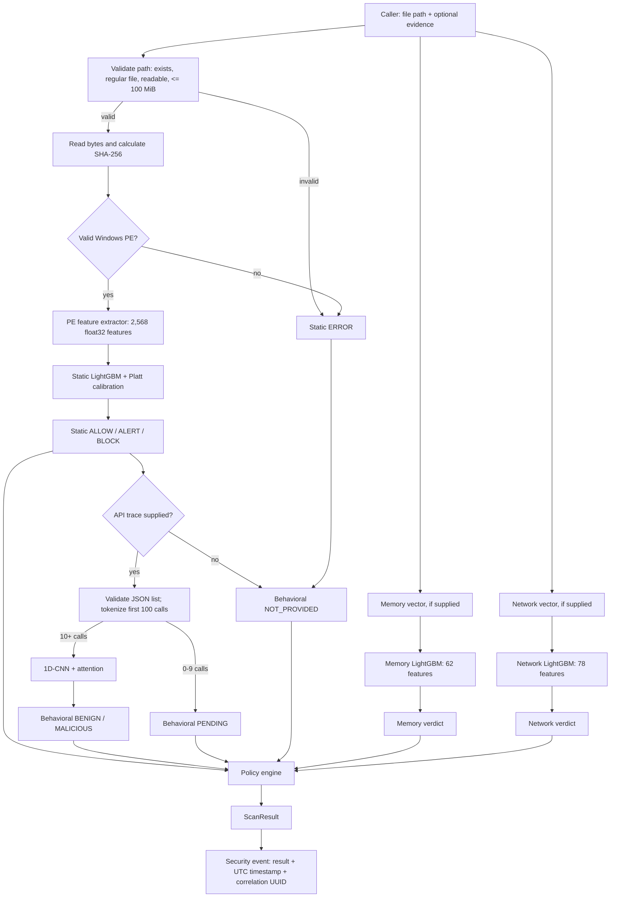
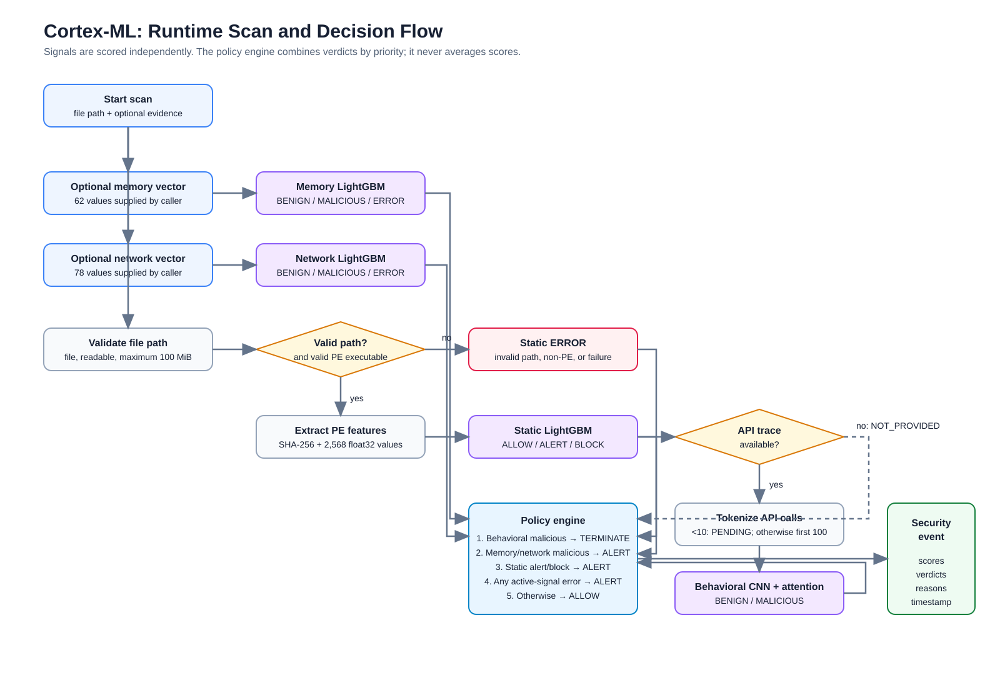
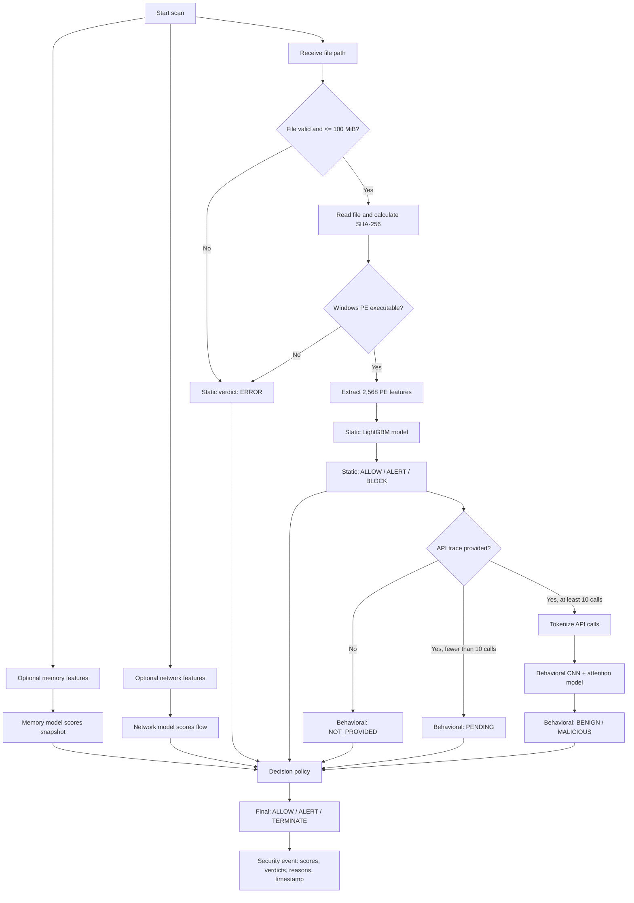
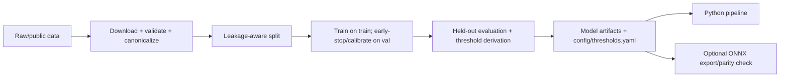

# Cortex-ML architecture, from scratch

This describes the code that runs today. Cortex-ML is a malware-analysis decision system with four active signals: static PE-file analysis, behavioral API-trace analysis, and optional memory and network analysis. A fifth signal, emulation, is trained and evaluated but deliberately does not affect a runtime decision.

Every signal's model architecture was chosen against this project's own data rather than inherited from the reference design it reproduces. A reference choice was made by other people, for their own reasons, on data that may differ, so each signal was re-checked against real local data and given the architecture that data justified: for static and behavioral that matched the reference design, for memory, network, and emulation it did not, each for a specific reason recorded under the signal below.

## In one sentence

The caller gives `CortexPipeline.scan()` a file path and may also give it an API-call JSON trace, a 62-value memory vector, and a 78-value network vector. Cortex scores available evidence, converts each score to a verdict from `config/thresholds.yaml`, and applies a priority policy—not an ensemble or averaged score—to return an auditable decision.

## Runtime flow

Memory and network scoring happen first and are not contingent on a valid file. That permits a caller to report fileless/injected activity or a network-only event. The PE/static/behavioral branch stops after a static error. Behavioral does run after static `ALLOW`, `ALERT`, or `BLOCK`; static block is not an early return.

### Reading the flow in plain language

The pipeline accepts a file and, when available, three additional evidence
sources: an API-call trace, memory features, and network-flow features. Each
model produces its own score and verdict. The final stage does **not** average
those scores; it applies safety-oriented priority rules to the verdicts.

The SVG above is the rendered version of the flow. The Mermaid source below
is kept as editable documentation.

| Evidence | What it looks at | Policy effect when malicious |
|---|---|---|
| Static | executable structure: headers, imports, sections, strings, signatures | `ALERT` (a static `BLOCK` is currently capped to `ALERT`) |
| Behavioral | ordered Windows API calls made by the program | `TERMINATE` |
| Memory | caller-supplied memory-snapshot forensic features | `ALERT` |
| Network | caller-supplied network-flow statistics | `ALERT` |

If no supplied signal is malicious and no active signal errors, the result is
`ALLOW`. An `ALLOW` means no active supplied signal found malicious evidence;
it does not prove every kind of evidence was available.

### Inputs and ownership

| Input | Who produces it | Consumer | When absent |
|---|---|---|---|
| `file_path` | caller | `inference/pipeline.py` | static is `ERROR`; policy alerts |
| API-call JSON (`list[str]`) | external sandbox/collector | `tokenizer/api_tokenizer.py` | behavioral is `NOT_PROVIDED` |
| memory feature vector | external memory-dump/VolMemLyzer process | `CortexPipeline._run_memory` | memory is `NOT_PROVIDED` |
| network feature vector | external CICFlowMeter-compatible flow process | `CortexPipeline._run_network` | network is `NOT_PROVIDED` |

There is no live traffic capture, memory-dump extraction, API instrumentation, model-serving API, queue, database, or web service in this repository. This code starts at those supplied inputs and returns a Python `ScanResult` / JSON-ready event.

## Active signals

### Cortex-Static: PE-file model

`features/pe_features.py` checks whether bytes parse as a Windows PE. For valid PEs, `PEFeatureExtractor` creates a fixed 2,568-element float32 vector from file size, byte and entropy histograms, strings, PE header, sections, imports, exports, data directories, Rich header, Authenticode signature, and PE-format warnings. `features/ember2024_adapter.py` converts the same grouped-feature shape from EMBER2024 records for offline training.

`models/static_lgbm.py` applies LightGBM then an optional Platt logistic calibrator fitted on the booster’s raw margin. Its persisted artifact is `<base>.lgbm` plus `<base>.meta`; metadata carries feature count, best iteration, model hash, and calibrator.

| Score band | Static verdict |
|---|---|
| `< 0.5471026402140103` | `ALLOW` |
| below `0.9798998555119341` | `ALERT` |
| `>= 0.9798998555119341` | `BLOCK` |

These values load at import time from `config/thresholds.yaml`, the single source of truth. Missing or malformed configuration fails loudly.

### Cortex-Behavioral: ordered API-trace model

`ApiTokenizer` owns `<PAD>` and `<UNK>`, uses a vocabulary built from training only, maps unknown names to `<UNK>`, and retains the first 100 API names.

| Real calls | Pipeline result |
|---|---|
| 0 | `PENDING` |
| 1–9 | `PENDING` |
| 10–99 | score padded sequence; add `behavioral_short_trace` |
| 100 | score it |
| >100 | score only the first 100 |

`CortexBehavioralNet` embeds tokens, adds learned positions, applies four 1D convolution blocks (kernels 3/5/7/3), four-head self-attention, global average pooling, and a binary-logit head. The pipeline applies sigmoid; a score `>= 0.60` is `MALICIOUS`, otherwise `BENIGN`.

### Cortex-Memory: supplied snapshot features

Offline data contains 55 VolMemLyzer columns. `features/memory_features.py` adds seven deterministic forensic ratios: callbacks, service drivers, file/mutant handles, process hiding, hidden DLLs, and injection rate. That makes 62 features. The deployed tree path uses those raw-plus-derived values directly; the included scaler is for a possible future non-tree model and is not used by this LightGBM model.

At runtime the caller supplies an already ordered 62-value vector. `MemoryLGBMModel` emits `MALICIOUS` at `>= 0.0006464189644018`, else `BENIGN`. A supplied vector with no configured model remains `NOT_PROVIDED`; a scoring exception becomes `ERROR`.

Architecture choice: the reference design used a deep residual MLP for this signal; Cortex-Memory uses LightGBM. The features are ~55–70 engineered numeric statistics — tabular data, the same class as Cortex-Static — and at roughly 58K rows a deep network needs far more data to beat gradient-boosted trees on that kind of input, so the MLP would add complexity for no expected gain. Reusing the already-working Cortex-Static LightGBM pipeline also kept a second model architecture off the debugging surface.

### Cortex-Network: supplied flow features

`data/download_network.py` defines the canonical 78 CICFlowMeter-compatible columns after removing identity-like fields such as flow ID, source IP, source port, and destination IP. Runtime does not derive them; the caller supplies the ordered vector. `NetworkLGBMModel` emits `MALICIOUS` at `>= 0.5883628015255921`, else `BENIGN`.

Architecture choice: the reference design used an autoencoder + classifier hybrid for this signal; Cortex-Network uses LightGBM, for two reasons found before any code was written. The reference repository's own checked-in metrics file reported `anomaly_auc: 0.062` for that autoencoder — a value that low is a visible sign the design was not working even in the implementation it came from. And the flow features are 78 engineered per-flow statistics, i.e. tabular, so LightGBM is the simpler, better-justified default; the autoencoder hybrid stays a legitimate future capability, not a starting point.

### Cortex-Emulation: offline/report-only

The Speakeasy/Quo Vadis loader preserves the authors’ time-separated split, keeps only `module_entry` traces for modelling, collapses exact duplicate API sequences inside each authored partition, and tokenizes first 500 calls. Its CNN-attention model is similar to behavioral but has a separate vocabulary and 500-step input.

Architecture choice: the reference design used a GRU over opcode and memory-access-trace data; Cortex-Emulation reuses Cortex-Behavioral's 1D-CNN + attention family instead. Inspecting the real dataset showed the emulator had been run with `"memory_tracing": false`, so the opcode-level and memory-access-pattern traces that GRU was built to consume are simply not present — the only signal in the data is API-call name sequences, the same problem Cortex-Behavioral already handles.

It has a threshold and `EmulationVerdict` helper, but `pipeline.scan()`, `ScanResult`, and `decide()` do not use it. It is telemetry/offline evaluation only because observed temporal concept drift makes it unsuitable as a policy input.

## Decision policy

Scores are never averaged. `inference/policy_engine.py::decide()` uses this first-match priority:

1. Behavioral `MALICIOUS` → `TERMINATE`.
2. Memory `MALICIOUS` → `ALERT`.
3. Network `MALICIOUS` → `ALERT`.
4. Static `ALERT` or `BLOCK` → `ALERT`.
5. Any static, behavioral, memory, or network `ERROR` → `ALERT`.
6. Otherwise → `ALLOW`.

Static `BLOCK` is intentionally interim-capped to final `ALERT`, while the static verdict remains `BLOCK` for audit and adds `static_block_capped_at_alert`. Memory and network are also capped at alert. Therefore `FinalDecision.BLOCK` exists in the enum but is not currently returned; only behavioral maliciousness can produce `TERMINATE`.

The result contains the path, SHA-256 when bytes were read, all four score/verdict pairs, final decision, and reason codes. `to_security_event()` adds an ISO-8601 UTC timestamp and a fresh correlation UUID.

## Offline lifecycle: raw data to a runtime artifact

| Signal | Data / canonicalization | Split protection | Trainer/output |
|---|---|---|---|
| Static | EMBER2024 PE records; dedupe SHA-256 or feature hash | random validation carve-out from train; separate test; drop unlabeled `-1` | `train_static.py` → static `.lgbm` + `.meta` |
| Behavioral | Mal-API-2019, MalbehavD-V1, Carpenter benign data; dedupe real IDs | group identity/family/source before stratified allocation | `train_behavioral.py` → checkpoint + `api_vocab.json` |
| Memory | CIC-MalMem-2022 CSV, validated 55-column schema | group related sample IDs and exact feature duplicates; verify no leakage | `train_memory.py` → memory `.lgbm` + `.meta` |
| Network | CSE-CIC-IDS2018 CSVs; align schema, clean, memory-safe stratified sampling | exclude ambiguous feature groups; group duplicate vectors; stratify by day/attack | `train_network.py` → network `.lgbm` + `.meta` |
| Emulation | Speakeasy raw JSON with original entry JSON preserved | retain Jan(train)/Apr(test); module-entry only; collapse duplicates inside each side | `train_emulation.py` → checkpoint + `emulation_vocab.json` |

The three active LightGBM trainers early-stop on validation and may fit Platt calibration on raw validation margins. Behavioral and emulation use PyTorch with weighted binary loss, AdamW, cosine warm restarts, gradient clipping, and early stopping; emulation also monitors an AUC gap. Thresholds must be re-derived after retraining because fitted score scales are not portable.

## Export and verification

`export/export_onnx.py` exports static, memory, and network models to ONNX and reconstructs the booster margin so the saved Platt calibrator stays inside the graph. The output is calibrated malicious probability, not raw tree score. It also exports behavioral PyTorch models. `export/quantize.py` dynamically INT8-quantizes behavioral ONNX and compares outputs/latency; tree models are not quantized.

`scripts/verify_onnx_parity.py` checks Python-versus-ONNX behavior. Tests cover the policy truth table and thresholds, PE feature-vector contract/determinism/signed-file behavior, model-evaluation structure, and optional artifact-backed ONNX parity.

## Repository map

| Location | Responsibility |
|---|---|
| `inference/pipeline.py` | runtime orchestration, validation, scoring, security event |
| `inference/policy_engine.py` | verdict conversion, priority policy, result schema |
| `config/thresholds.yaml` | authoritative thresholds |
| `features/` | PE features, EMBER adapter, memory feature derivation/scaler |
| `tokenizer/` | behavioral/emulation vocabulary and sequence contracts |
| `models/` | LightGBM/CNN definitions, training, metrics, persistence |
| `data/` | source acquisition, validation, canonical parquet creation |
| `scripts/` | split, train, evaluate, ONNX verification CLIs |
| `export/` | ONNX conversion and behavioral quantization |
| `tests/` | regression and optional artifact-backed checks |

## Current safety boundaries

- Static feature-fidelity / false-positive work is unresolved; static `BLOCK` cannot autonomously block.
- Memory and network validation comes from bounded research datasets, so each can alert but cannot block or terminate.
- Behavioral traces under ten calls intentionally stay `PENDING`.
- Emulation intentionally does not participate in policy.
- Final `ALLOW` means no active supplied signal produced malicious evidence; it does not prove every possible signal was available.
